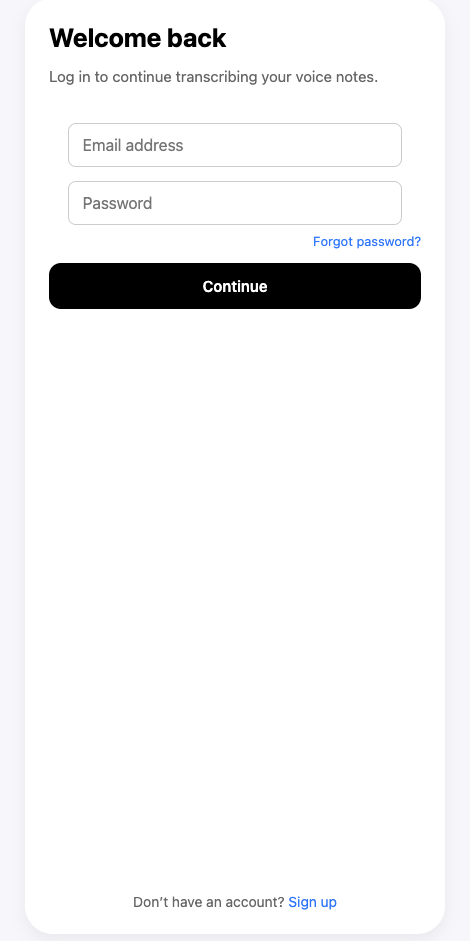
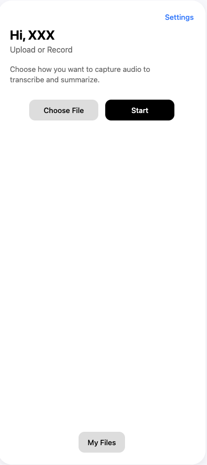

# Voice-To-Text Application

## Authors
- Adam Jabbar  
- Jeremiah Hackworth  
- Neako Romas  
- Shinji Kato  


## Overview
The Voice-To-Text Application is designed to provide users with an efficient and reliable way to **transcribe** and **summarize** audio recordings such as lectures, meetings, and voice notes.  
It leverages **speech-to-text (STT)** and **natural language processing (NLP)** technologies to convert audio into accurate transcripts and concise summaries.


## Target Users
- **Students**: Transcribe lectures and study notes  
- **General Users**: Quick and accurate transcription of meetings, memos, and recordings  

 # voice2summarizer

A simple end-to-end web app that converts uploaded audio into text and AI-generated summaries.

## Project Structure

```text
voice2summarizer/
  backend/   - FastAPI + Google Speech-to-Text + OpenAI summarization
  frontend/  - React single-page UI
```

## Prerequisites

- Python 3.10+
- Node.js 18+
- ffmpeg installed on your system
- A Google Cloud project with Speech-to-Text enabled
- An OpenAI API key

---
  
## 1. Clone this repository

```bash
git clone https://github.com/Doonshin/voice-summarizer.git
cd voice2summarizer
```

## 2. Backend Setup

```bash
cd backend
cp .env.example .env
```

Edit `.env` and fill in:

```env
OPENAI_API_KEY=your-openai-key-here
GOOGLE_APPLICATION_CREDENTIALS=/absolute/path/to/google-service-account.json
```

Install dependencies:

```bash
pip install -r requirements.txt
```

Run backend:

```bash
uvicorn main:app --reload
```

Backend will be available at: http://localhost:8000

---

## 3. Frontend Setup

```bash
cd ../frontend
cp .env.example .env
```

Edit `frontend/.env` if needed (default points to local backend):

```env
VITE_API_BASE=http://localhost:8000/api
```

Install dependencies and start dev server:

```bash
npm install
npm run dev
```

Frontend will be available at: http://localhost:5173

---

## 4. Usage

1. Open the frontend in your browser
2. Upload an audio file (.mp3, .wav, .m4a)
3. Click **Transcribe Latest** to run Google Speech-to-Text
4. Click **Summarize Latest** to generate an AI summary using OpenAI
5. See the transcript & summary displayed on the page

---

## Environment Variables

### Backend (`backend/.env`)

- `OPENAI_API_KEY`: Your OpenAI API key
- `GOOGLE_APPLICATION_CREDENTIALS`: Absolute path to your Google Cloud service account JSON

### Frontend (`frontend/.env`)

- `VITE_API_BASE`: Base URL for the backend API (default: `http://localhost:8000/api`)

---

## License

MIT
